# 📄 Dokumentasi Aplikasi Web Never Potato!

**Nama Aplikasi:** Never Potato!  
**Teknologi:** PHP, MySQL, HTML, CSS, JavaScript  
**Database:** neverpotato  
**Server:** XAMPP (localhost)

---

## 🗄️ 1. Struktur Database

Database `neverpotato` memiliki 1 tabel yaitu `menu` dengan kolom:
`id`, `nama_menu`, `harga`, `emoji`, `kategori`, `created_at`

### Tampilan Database di phpMyAdmin

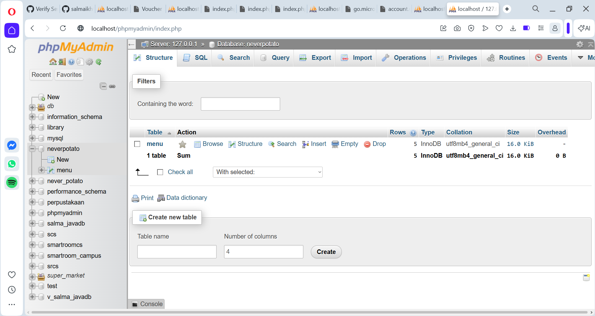

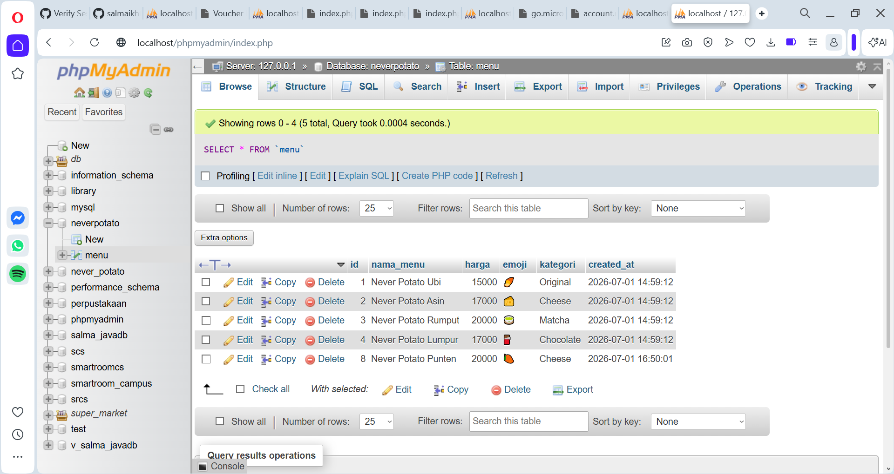

---

## 🏠 2. Halaman Beranda (index.php)

Halaman utama yang menampilkan logo **Never Potato!**, gambar cup boba pixel art dengan animasi floating, dan tagline aplikasi.

Navigasi tersedia ke halaman: Beranda, Menu, +Menu Baru, dan Kelola.

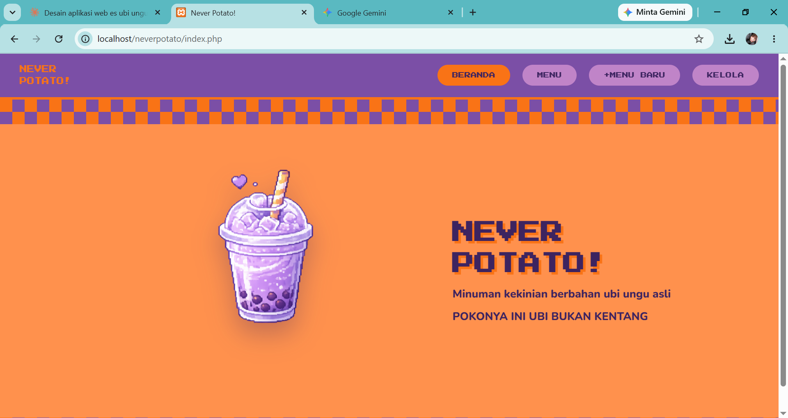

---

## 🧾 3. Halaman Menu (menu.php)

Menampilkan seluruh data menu yang tersimpan di database dalam bentuk card grid.

Setiap card menampilkan emoji ikon, nama menu, harga, dan kategori.

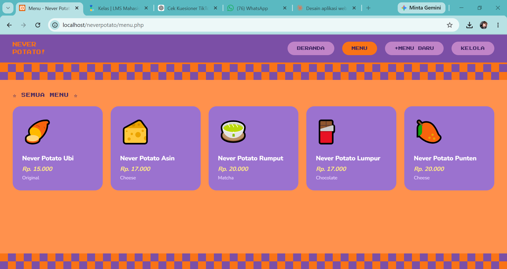

---

## ➕ 4. Halaman Tambah Menu (tambah.php)

Form input data menu baru dengan field:
- Nama Menu
- Harga
- Emoji Ikon
- Kategori

### Form kosong (sebelum diisi)

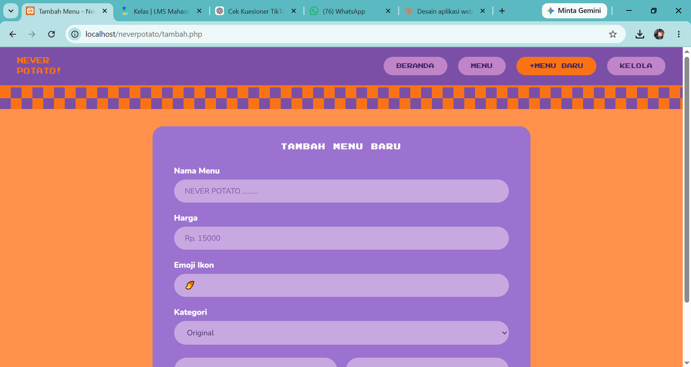

### Form diisi (contoh: Never Potato Pink)

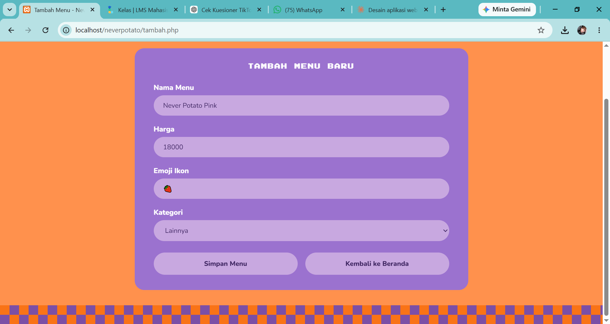

### Hasil setelah data disimpan — tampil di halaman Menu

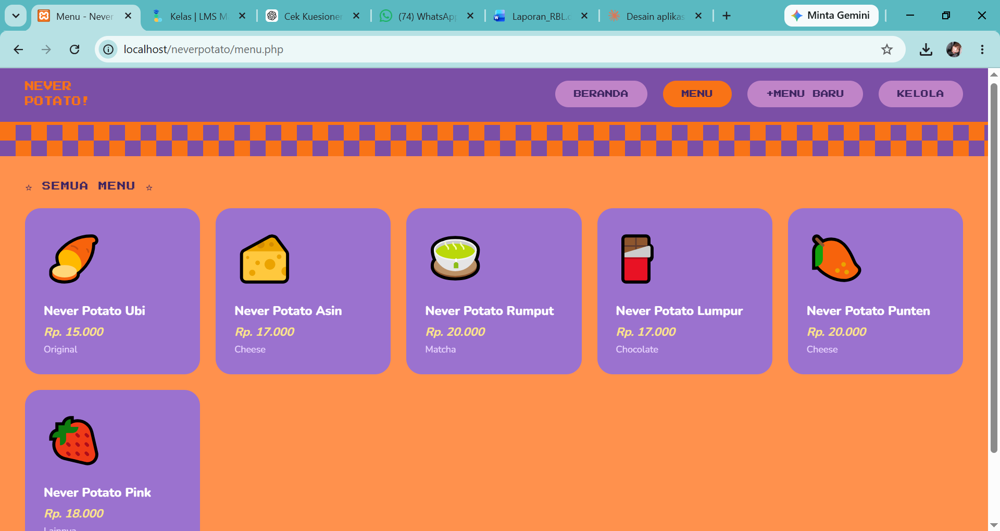

### Data tersimpan di database

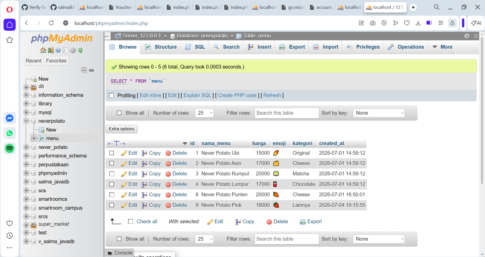

---

## ✏️ 5. Halaman Edit Menu (edit.php)

Form edit data menu yang sudah ada. Data otomatis terisi sesuai data yang dipilih.

### Tampilan form edit

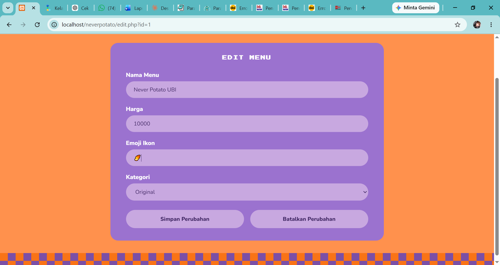

### Hasil setelah data diedit — tampil di halaman Menu

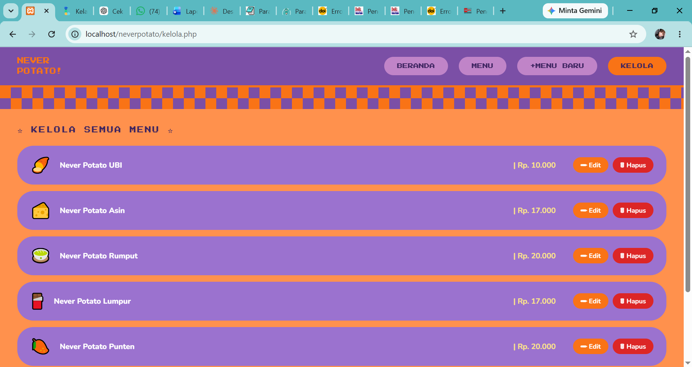

### Data terupdate di database

---

## 🗑️ 6. Halaman Kelola & Hapus (kelola.php)

Menampilkan semua menu dalam bentuk list dengan tombol **Edit** dan **Hapus** di setiap baris.

### Tampilan halaman Kelola

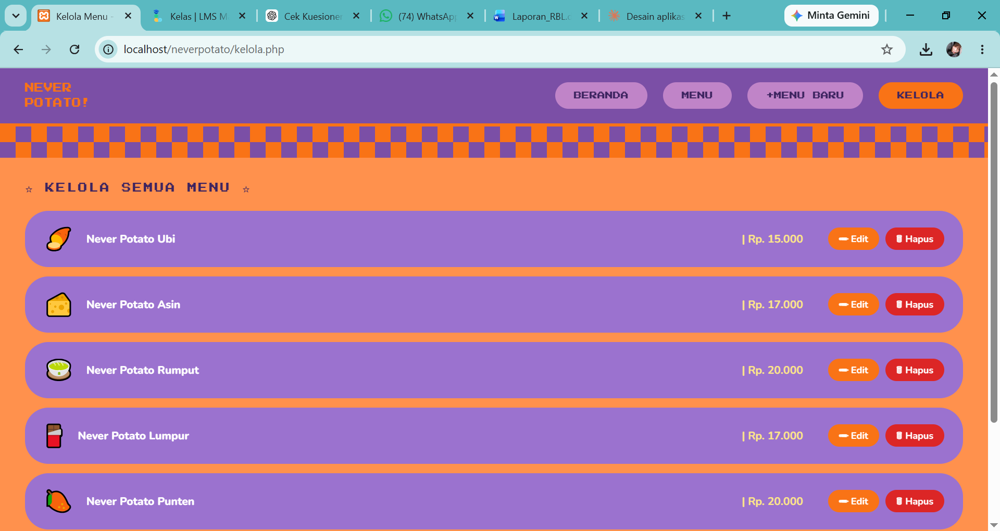

### Konfirmasi hapus (modal popup)

Saat tombol Hapus diklik, muncul modal konfirmasi sebelum data benar-benar dihapus.

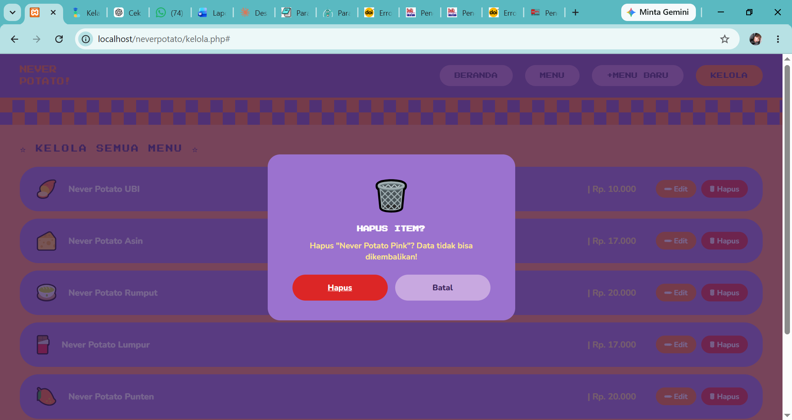

### Tampilan Kelola setelah data dihapus

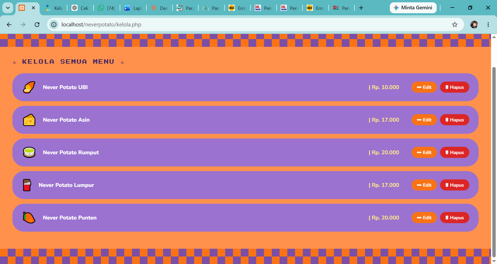

### Tampilan Menu setelah data dihapus

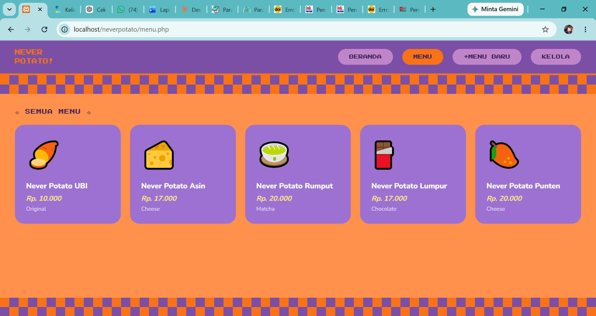

### Database setelah data dihapus

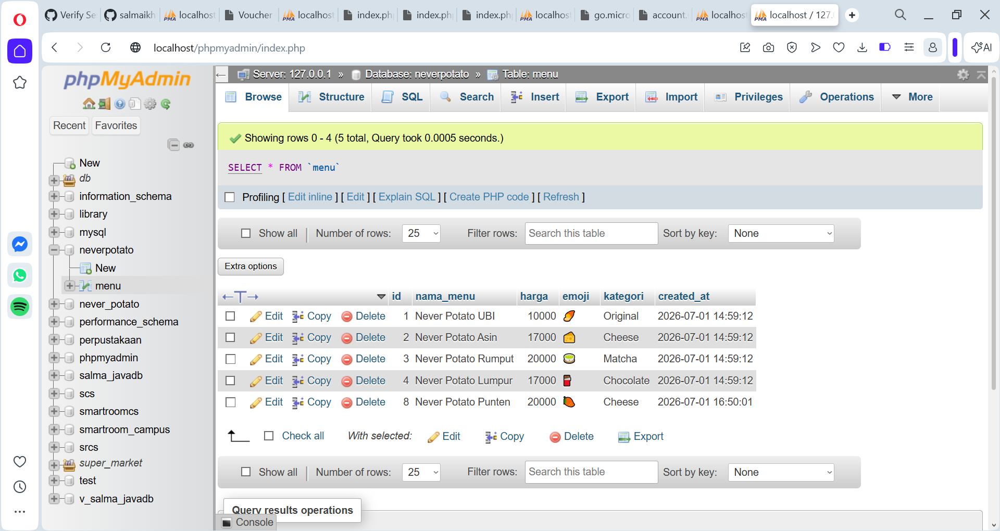

---

## ✅ Kesimpulan

Aplikasi **Never Potato!** berhasil menerapkan skema **CRUD** (Create, Read, Update, Delete) dengan:

| Operasi | File | Keterangan |
|--------|------|------------|
| **Create** | tambah.php | Menambah data menu baru |
| **Read** | index.php, menu.php | Menampilkan data dari database |
| **Update** | edit.php | Mengedit data menu yang ada |
| **Delete** | hapus.php, kelola.php | Menghapus data menu |